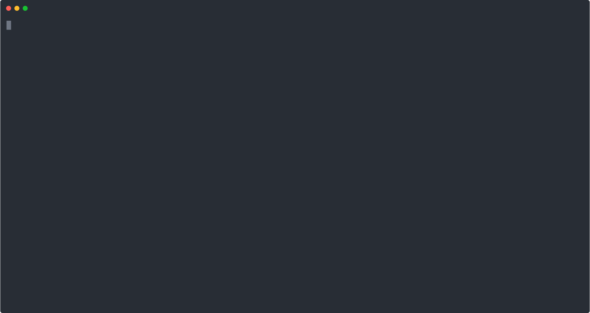

# hAIry Botter


Chatbots are useful, especially after reading about the [https://github.com/YonkoSam/whatsapp-python-chatbot](https://github.com/YonkoSam/whatsapp-python-chatbot) on Reddit.
I thought why not create a bit more flexible one, not hardcoding to any kind of frontend.

So this project was born, a simple HTTP based server, with history storing.

There could be many improvements for example:
- Add more AI backends
- Add a better history store
- Add actually usable (chat) frontends

Right now you just need a frontend for any kind of chat and you can call this stuff.

Happy playing!

## Usage

### Pre-requisites

Required env variable(s):
- `GEMINI_API_KEY` - For the Gemini API access

Optional env variable(s):
- `ADDR` - Listen address for the server (Default: `:8080`)
- `GEMINI_MODEL` - Model to use (Default: `gemini-2.5-flash-preview-04-17`)
- `MCP_SSE_SERVER` - MCP SSE server for external function calls (Eg.: `http://localhost:8081/sse`)

All the history will be stored under the `history-gemini` folder.

### Running the server

Run the server from source:
```
go run cmd/bot-server/main.go
```

But feel free to download a pre-build package and then just run the binary. The env variables are still the same.

### Example call without unique user id:

If you don't have a user id, you can call the server without it. This will create a new session cookie and store an ID in it.

Example call for the server:
```
curl -v -X POST http://127.0.0.1:8080/message -d "message=Hi there"
```

This will return a cookie which will have a `sessionID`. You need to use this if you want to keep a history, for example:

```
curl -v -X POST -H "Cookie: sessionID=MGVQOSOZWPMKWAJBQN5KWFR3DF" http://127.0.0.1:8080/message -d "message=Hi there"
```

### Example call without unique user id:

If you have a user id, you can use it in the call.

```
curl -v -H "X-User-ID: someuserid1" -X POST http://127.0.0.1:8080/message -d "message=Hi there"
```


### Client examples

#### CLI client

You can use the CLI client to call the server. It should work out of the box, but there are some optional enviroment variables:
- `SERVER_URL` - Server base URL if it was changed from the port 8080

```
go run cmd/cli-client/main.go
```

This will lunch an interactive terminal to discuss with.

Feel free to use the generated binary in the release as well.




#### Facebook messenger client

You can connect the server to Facebook Messenger with this, you will need to have a page and setup the secrets properly. (How to do it is not the scope of this doc.)

Required env variables:
- `ACCESS_TOKEN` - Access token from the Developer portal
- `VERIFY_TOKEN` - Verify token from the Developer portal you setup

Optional env variables:
- `GRAPHQL_URL` - GraphQL base url (Default: `https://graph.facebook.com/v22.0`)
- `ADDR` - Server listening address (Default: `:8082`)
- `AI_SERVICE` - AI service (the server-bot's) address (Default: `http://127.0.0.1:8080`)

Then you can start chatting with the bot via sending a message to the page.
(If you configured an MCP in the AI service it will be called too.)

For local testing you can use ngrok to expose the URL and test it via the Messenger app.
(For example: `ngrok http 8082`)

### Notes

Please do not run this server publicly available for your own safety. (And for your budget, if it is public, anybody can use it and it can quickly add up in the Gemini API usage.)
It is intended to be an "internal" helper for devs.
