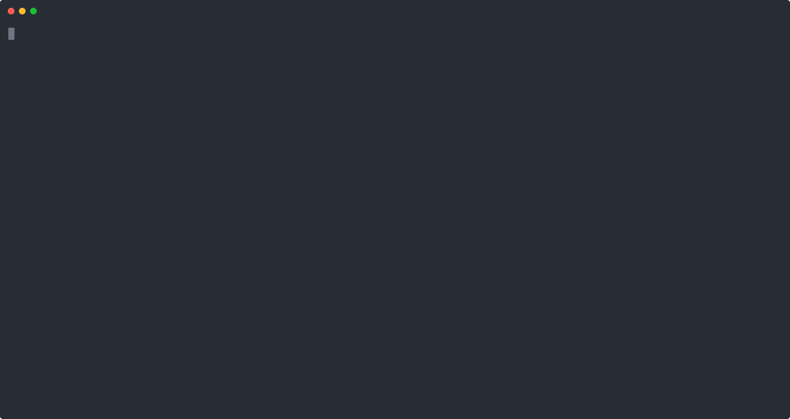

<div align="center">


# hAIry Botter 🪄 ✨

**A flexible, HTTP-based AI Chatbot Server powered by Gemini via Firebase Genkit.**

[](https://goreportcard.com/report/github.com/yourusername/hairy-botter)
[](https://opensource.org/licenses/MIT)
[](https://deepmind.google/technologies/gemini/)

</div>

---

## 📖 Overview

**hAIry Botter** is a lightweight, backend-agnostic AI server designed to decouple the AI logic from the frontend. Inspired by the [WhatsApp Python Chatbot](https://github.com/YonkoSam/whatsapp-python-chatbot), this project aims to be more flexible by offering a simple HTTP API that supports history, context, and external tools.

Whether you are building a CLI, a Telegram bot, or a web interface, you just need to make a simple HTTP call to hAIry Botter to get started.

## ✨ Features

* 🧠 **Genkit Powered:** Uses [Firebase Genkit](https://firebase.google.com/docs/genkit) as the AI framework, backed by Google Gemini models. Swapping providers (Vertex AI, Ollama, etc.) requires only a plugin change.
* 🔌 **MCP Support:** Implements the **Model Context Protocol** to call external servers/functions via Genkit's MCP plugin (includes example implementation).
* 💾 **Smart History:** Session-based history storage (`history-gemini` folder) with optional auto-summarization to save context window.
* 📚 **RAG Capable:** Built-in Retrieval-Augmented Generation. Drop text documents into the `bot-context` folder to chat with your data.
* 🎭 **Custom Personality:** Role and system prompt defined directly in `config.yaml`.
* 🤖 **Multi-agent / Sub-agent:** Agents can expose themselves as MCP servers (HTTP or stdio) so an orchestrator can delegate tasks to specialised sub-agents, each with its own config, model, and tool set.
* 🖼️ **Multi-modal:** Native support for Image and PDF inputs.
* 🚀 **Ready-to-use Clients:** Includes CLI, Telegram, and Facebook Messenger clients.

---

## 🚀 Quick Start

### Option 1: Docker (Recommended)

The easiest way to get up and running is via Docker Compose.

1.  Copy `config.yaml.example` to `config.yaml` and set your `api_keys.gemini` value.
2.  Run the stack:

```bash
docker-compose up
```

### Option 2: Running from Source

**Prerequisites:** Go installed on your machine.

1.  Copy `config.yaml.example` to `config.yaml` and set your Gemini API key:
    ```yaml
    api_keys:
      gemini: "your_api_key_here"
    ```
    Alternatively, set the `GEMINI_API_KEY` environment variable — it is used as a fallback when the key is absent from the file.
2.  Run the server (it auto-loads `config.yaml` from the working directory):
    ```bash
    go run cmd/server-bot/main.go
    ```

---

## ⚙️ Configuration

All configuration lives in `config.yaml`. Copy `config.yaml.example` to `config.yaml` and edit it. A different path can be supplied with `-config <path>`.

```yaml
run_mode: "agent"          # "agent" (HTTP server) or "mcp_cli" (stdio sub-agent)
model: "gemini-flash-latest"
gemini_search_disabled: false
log_level: "info"

personality:
  role: "Helpful assistant"
  system_prompt: "You are hAIry, a concise and friendly AI assistant."

agent_config:
  enable_chat_proxy: true   # expose POST /message
  http_port: ":8080"
  enable_mcp_http: false    # expose this agent as an MCP server
  mcp_port: ":8081"

capabilities:
  rag:
    enabled: true
    directory: "./bot-context"
  history_summary:
    enabled: true
    message_count: 20
  mcp_servers:
    - type: http
      path: http://localhost:8082/mcp
    - type: cli                        # launched as child process via stdio
      path: "go"
      args: ["run", "cmd/server-mcp-skills/main.go"]

context:
  auto_inject:              # files appended to the system prompt at startup
    - "TODO.md"

api_keys:
  gemini: ""                # or set GEMINI_API_KEY env var as fallback
```

See `config.yaml.example` for the full reference with all options and comments.

> **Note on MCP:** Tool names must be unique across all connected MCP servers — duplicate names override each other.

> **Note on Search + MCP:** Google Search grounding and MCP tools work simultaneously on Gemini 2.5+ models. Disable search with `gemini_search_disabled: true`.

---

## 📡 API Usage

The server exposes a simple HTTP endpoint.

### 1. New Conversation (No Session)
If you don't provide a User ID, the server generates a new session and returns it in a cookie.

```bash
curl -v -X POST http://127.0.0.1:8080/message \
  -d "message=Hi there"
```

### 2. Continued Conversation (With Session)
To maintain history, pass the `sessionID` cookie returned from the first call.

```bash
curl -v -X POST \
  -H "Cookie: sessionID=MGVQOSOZWPMKWAJBQN5KWFR3DF" \
  http://127.0.0.1:8080/message \
  -d "message=Hi again"
```

### 3. Using a Custom User ID
If your frontend manages users, pass the ID via header.

```bash
curl -v -X POST \
  -H "X-User-ID: unique-user-123" \
  http://127.0.0.1:8080/message \
  -d "message=Hi there"
```

### 4. Multi-modal (Images & PDFs)
Send files using `multipart/form-data`.

```bash
curl -v -X POST \
  -F "message=What is on this image?" \
  -F "payload=@local_image.jpg" \
  http://127.0.0.1:8080/message
```

---

## 📱 Included Clients

This repo comes with ready-made clients to demonstrate capabilities.

### 🖥️ CLI Client
An interactive terminal chat.

```bash
# Optional: Set SERVER_URL if not using localhost:8080
go run cmd/client-cli/main.go
```


### ✈️ Telegram Bot
Requires a Bot Token from BotFather.

```bash
export BOT_TOKEN="your_telegram_token"
# Optional: restrict access to specific usernames
export USERNAME_LIMITS="user1,user2" 

go run cmd/client-telegram/main.go
```
*Tip: Captions on images are treated as the prompt.*

### 💬 Facebook Messenger
Requires a configured Facebook App/Page.

**Env Variables:**
* `ACCESS_TOKEN`, `VERIFY_TOKEN`, `APP_SECRET` (Required)
* `ADDR` (Default: `:8082`)
* `AI_SERVICE` (Default: `http://127.0.0.1:8080`)

```bash
go run cmd/client-fb-messenger/main.go
```
*Tip: Use `ngrok http 8082` to expose this to Facebook for local testing.*

---

## 🎭 Personality

The system prompt is defined directly in `config.yaml` under the `personality` section:

```yaml
personality:
  role: "Senior Go Developer"
  system_prompt: "You are an autonomous coding agent. Always check TODO.md before writing code."
```

Both fields are concatenated to form the effective system prompt. Additional context files can be appended at startup via `context.auto_inject`.

> **Note:** Previous versions used a separate `personality.txt` file. This has been removed — move your prompt into `config.yaml`.

---

## 💾 History Compatibility

History files are stored in the `history-gemini/` folder as JSON. After the migration from the raw `genai` SDK to Firebase Genkit, the internal message format changed (`parts` → `content`). **Old history files are not compatible** and should be deleted or the folder cleared before upgrading.

---

## 🛠️ Skills MCP Server

The repo includes a dedicated MCP (Model Context Protocol) server designed to give the AI agent autonomous access to a sandboxed environment. This allows the AI to run commands, edit code, and modify files—similar to how tools like OpenDevin or OpenClaw work.

**Features & Tools:**
- `execute_command`: Execute arbitrary shell commands in the container.
- `list_files`: List files and directories within a given path.
- `read_file`: Read the contents of a specific file.
- `write_file`: Write or overwrite the contents of a file.

**Running the Skills Server:**
To run the full stack with the Skills MCP Server enabled, use the dedicated compose file:

```bash
docker-compose -f docker-compose-skill.yml up
```

**Docker Environment:**
The Skills MCP Server runs in an Alpine Linux Docker container. This means the AI has access to a real shell and can use package managers like `apk` to install additional applications dynamically if it needs them to accomplish a task.
*(Note: Since it is a container, installed applications and environment changes are not persistent between restarts unless explicitly mounted).*

---

## ⚠️ Important Notes

> **Security Warning:** Please do not run this server on the public internet without additional authentication. It is intended as an internal helper tool. Public exposure could lead to excessive API usage and costs. Furthermore, running the **Skills MCP Server** gives the AI the ability to execute arbitrary shell commands inside its container. Do not expose this environment or grant it access to sensitive host directories.

> **💡 Pro Tip:** When using the **Skills MCP Server**, you can drop text files explaining specific "skills" or commands into the RAG `bot-context/` folder. These files become part of the prompt, teaching the AI exactly how to use specific CLI tools or project structures!
